# TDB Web Crawler

## Overview

tdb-web-crawler is a scalable, async-first system designed to crawl trusted news sources, extract meaningful article content, and index content for downstream consumption by The Daily Briefing app. This repo showcases the V0 implementation/architecture of our crawling/indexing process.

## Architecture


The system is composed of the following components:

- Crawler: Uses aiohttp and BeautifulSoup to crawl HTML pages asynchronously. Using a headless browser to execute js was a secondary concern since most news article content is server-side rendered.
- Robots.txt Parser: Ensures ethical crawling by adhering to robots.txt.
- Extractor: Extracts title, body, and image links from raw HTML.
- Keyword Model: Leverages transformer-based models like KeyBERT to extract top keywords.
- Persistence Layer: Saves crawled and processed data to Firestore.
- Dispatcher: Orchestrates indexing jobs and handles task queue fan-out. The task queue not only grants some level of concurrency but also ensures fault tolerance.

## Alternatives

### Keyword Model

We considered several approaches for keyword extraction:
	- TF-IDF / RAKE: Lightweight but lacked semantic understanding and often surfaced uninformative tokens.
	- SpaCy / Gensim: Better linguistic preprocessing but still largely statistical in nature.
	- KeyBERT (Current): Chosen for its balance of simplicity and power. It uses sentence-transformers under the hood to extract semantically relevant keywords, and performs well even on short-form articles.

In the future, we may explore fine-tuned LLM-based extractors for richer tagging and summarization (albeit this route is certainly more expensive).

### Infrastructure

Our current infrastructure is built on Google Cloud Platform (GCP). This decision was influenced by the MVP impl of The Daily Briefing app, which used Firebase for rapid prototyping and simplified the authentication, database, and hosting needs.

However, we recognize trade-offs:
	- Pub/Sub as a Task Queue:

While GCP Pub/Sub is highly scalable and decouples our processing stages, it lacks the more ergonomic task queue features of platforms like:

- AWS SQS: Offers simpler FIFO queues and tighter integration with Lambda.

- Temporal: Provides workflow orchestration, retries, timeout management, and durable state by default.
Pub/Sub requires custom logic to handle:
- Retry backoff
- Dead letter queues
- Message deduplication 

## Performance

## Future Improvements
- Execute JS with Playwright: Support for JS-rendered pages via headless browser automation.
- DNS Cache: Improve crawl speed by caching DNS resolutions to reduce repeated lookups.
- Retry Strategy: Smarter handling of transient errors and HTTP failures.
- Per-domain Throttling: Rate limit requests per domain to avoid bans.

## Run the tests

```
pytest
```

## Deploy

### crawler

```
gcloud functions deploy crawler \
  --runtime python311 \
  --trigger-topic crawler \
  --entry-point run_crawl_job \
  --source . \
  --region us-central1 \
  --memory 512MB \
  --timeout 300s \
  --set-env-vars GCP_PROJECT={},PUBSUB_EXTRACTION_TOPIC={}
  ```

Manually trigger for testing purposes

```
gcloud pubsub topics publish crawler \
  --message='{"seed_urls":["https://www.cnn.com"],"max_pages":1000,"num_workers":20}'
```

### crawler-extract 

```
gcloud functions deploy crawler-extract \
  --runtime python311 \
  --trigger-topic crawler-extract \
  --entry-point run_extract_job \
  --source . \
  --region us-central1 \
  --memory 512MB \
  --timeout 60s \
  --set-env-vars GCP_PROJECT={},PUBSUB_EXTRACTION_TOPIC={}
```

Manually trigger for testing purposes

```
gcloud pubsub topics publish crawler-extract \
  --message='{"url":"https://www.cnn.com/politics/live-news"}'
```
